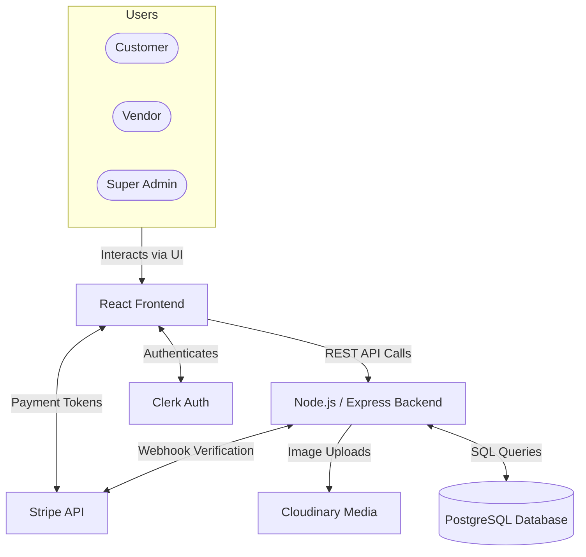

# EComVerse - Multi-Tenant E-Commerce SaaS Platform

**Live Demo:** [Visit EComVerse](https://multi-tenant-e-commerce-platform-sa-gold.vercel.app/)

## 📖 Project Overview
EComVerse is a comprehensive multi-vendor e-commerce Software-as-a-Service (SaaS) platform. It empowers independent vendors to launch their own digital storefronts, manage inventory, and process orders, while providing customers with a centralized, seamless global shopping experience. The platform operates on a commission-based revenue model, overseen by a central Super Admin.

## 🛠️ Technology Stack
- **Frontend:** React.js (Vite), Tailwind CSS, Redux Toolkit, Recharts (Data Visualization)
- **Backend:** Node.js, Express.js
- **Database:** PostgreSQL (Supabase)
- **Authentication:** Clerk (Role-based Auth)
- **Payments:** Stripe API (with secure Webhooks)
- **Media Storage:** Cloudinary
- **Deployment:** Vercel (Frontend), Render (Backend)

## 👥 Role-Based Architecture
The platform enforces strict data isolation and secure routing based on three primary user roles:

1. **Customer:** Can browse the global catalog, add items to their persistent wishlist, and securely checkout using Stripe.
2. **Vendor:** Gets an isolated dashboard to manage their store branding, upload products, track order fulfillment, view analytics, and request financial payouts.
3. **Super Admin:** Has a bird's-eye view of the entire platform. Can view global metrics (Total GMV, Platform Revenue), oversee all platform orders, and approve/reject vendor payout requests.

## 🏗️ System Architecture


## ✨ Core Features
- **Centralized Master Catalog:** A unified, responsive UI where customers can browse products from all vendors simultaneously.
- **Full-Stack Wishlist:** Users can save favorite items to a persistent, database-backed wishlist.
- **Automated Payout System:** Vendors accumulate earnings (minus a 10% platform commission) and can request payouts (minimum ₹100), which are reviewed by the Admin.
- **Stripe Payment Gateway:** Secure credit card processing with transaction ID tracking and webhook-based order confirmation.
- **Downloadable Excel Analytics:** Both Admins and Vendors can download `.xlsx` spreadsheets of their transaction history and revenue metrics for off-platform accounting.
- **Real-Time Data Visualization:** Interactive Line and Bar charts using Recharts for tracking revenue trajectories.

## 🗄️ Database Schema Overview
The PostgreSQL relational database is architected to maintain strict data integrity across tenants:
- `users`: Managed via Clerk synchronization, storing authorization roles.
- `stores`: Linked to a vendor (`owner_user_id`), containing branding and store status.
- `products`: Linked to a `store_id`, managing inventory, price, categories, and media.
- `orders` & `order_items`: Tracks transactions, payment statuses, and exact pricing snapshots at the time of purchase.
- `payouts`: Tracks the financial flow and withdrawal requests between the platform Admin and the Vendors.
- `wishlists`: Maps users to their saved products.

## 🚀 Local Setup Instructions

### 1. Database Setup
1. Create a new project on [Supabase](https://supabase.com).
2. Go to the SQL Editor and run the SQL migration scripts provided in `server/migrations/`.
3. Obtain your database URL.

### 2. Authentication & Keys
1. Create a new application on [Clerk](https://clerk.com) for Auth.
2. Obtain your **Stripe** API keys for payments.
3. Obtain your **Cloudinary** URL for image hosting.

### 3. Backend Setup
1. Navigate to the `server/` directory: `cd server`
2. Create a `.env` file with the following variables:
   ```env
   PORT=5000
   DATABASE_URL=your_supabase_postgresql_connection_string
   CLERK_SECRET_KEY=your_clerk_secret_key
   STRIPE_SECRET_KEY=your_stripe_test_secret_key
   CLOUDINARY_URL=your_cloudinary_url
   ```
3. Start the server: `npm start`

### 4. Frontend Setup
1. Navigate to the `client/` directory: `cd client`
2. Create a `.env` file with the following variables:
   ```env
   VITE_CLERK_PUBLISHABLE_KEY=your_clerk_publishable_key
   VITE_API_URL=http://localhost:5000/api
   VITE_STRIPE_PUBLISHABLE_KEY=your_stripe_publishable_key
   ```
3. Install dependencies: `npm install`
4. Start the development server: `npm run dev`

---

## 📈 Progress Report: 

This project was meticulously built over 4 weeks, transitioning from concept to a production-ready SaaS platform:

**Week 1: Architecture & Core Authentication**
* **Day 1:** Project setup, repository initialization, and environment configuration.
* **Day 2:** Designed Database architecture and created PostgreSQL schemas.
* **Day 3:** Scaffolded Node.js/Express backend and defined core API folder structures.
* **Day 4:** Integrated Clerk Authentication and built `POST /api/auth/sync` for DB synchronization.
* **Day 5:** Programmed Role-Based Access Control (RBAC) middleware for secure routing.
* **Day 6:** Initialized React frontend with Vite, Tailwind CSS, and Redux Toolkit.
* **Day 7:** Built Login/Register UI flows and synchronized Redux global user state.

**Week 2: Inventory & Store Management**
* **Day 8:** Developed Store API endpoints (Create/Read) with Vendor role protection.
* **Day 9:** Integrated Cloudinary for secure store logo and product image uploads.
* **Day 10:** Developed Product CRUD API endpoints with store ownership verification.
* **Day 11:** Designed Vendor Dashboard layout and built the Store Settings React UI.
* **Day 12:** Built Product Management UI (Add/Edit products, dynamic category tagging).
* **Day 13:** Implemented complex Inventory and Pricing logic (handling exact-pricing flat variants).
* **Day 14:** Conducted full-stack integration testing for the Vendor Portal.

**Week 3: Cart, Checkout & Payments**
* **Day 15:** Built Public Storefront UI (Home page, Master catalog grid, Product detail pages).
* **Day 16:** Implemented global Shopping Cart (Redux state, slide-over panel, live calculations).
* **Day 17:** Integrated Stripe Node SDK and built `/api/payments/create-intent` endpoint.
* **Day 18:** Engineered secure `/api/webhooks/stripe` endpoint using cryptographic signature verification.
* **Day 19:** Built Full-Stack Wishlist system allowing users to save and persist favorite items.
* **Day 20:** Built custom React checkout form and a dedicated Post-Checkout Order Success Screen.
* **Day 21:** Automated order receipts and integrated global Transaction ID tracking.

**Week 4: Analytics, Refinement & Deployment**
* **Day 22:** Developed Vendor Analytics, Wallet system, and Minimum ₹100 Payout Request logic.
* **Day 23:** Built Super Admin Analytics (`/api/admin/stats`) to aggregate total platform GMV and revenue.
* **Day 24:** Integrated `Recharts` to render interactive data visualizations on dashboards.
* **Day 25:** Added UI Security Lockouts (preventing Super Admins from utilizing customer checkouts).
* **Day 26:** Automated `.xlsx` Excel Report Generation for offline bookkeeping (Admin & Vendor).
* **Day 27:** Migrated platform currency to INR (₹) and finalized CI/CD build configurations.
* **Day 28:** Final Polish & Live Deployment to Vercel (Frontend) and Render (Backend).
